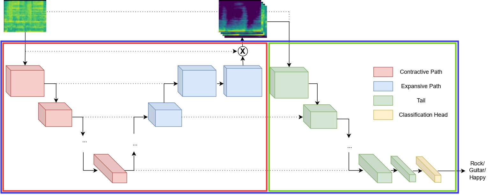

### !Repo under construction!

# MSSPT
Companion repository for the ICASSP-24 submission "Pre-Training Music Classification Models via Music Source Separation". In short, we propose pre-training U-Nets with a music source separation objective, and then appending a convolutional frontend upon them, in order to jointly train them in downstream music classification tasks. Experimental results in two widely used music classification datasets, [Magna-Tag-A-Tune](https://mirg.city.ac.uk/codeapps/the-magnatagatune-dataset) and [FMA](https://github.com/mdeff/fma) indicate that the proposed strategy can prove beneficial for music classification tasks. The repository contains the code necessary to reproduce the experiments and results reported in the paper, as well as pre-trained a) music source separation modules and b) downstream classifiers for both downstream tasks, for each possible source(s).
## Important note! 
The results acquired via this repository (and reported) in FMA do not correspond to its medium subset, but to the {medium-small} one (excluding thus the small subset).
# Architecture details

The proposed architecture (depicted in the figure above, blue rectangle) is an STFT-domain adaptation of the TUne+ architecture, modified to fit a traditional supervised learning framework. In essence, it consists of a U-Net network (red rectangle) followed by a convolutional frontend (green rectangle); the U-Net and the convolutional frontend are connected via skip connections. The U-Net is pre-trained with various music source separation objectives, and is based on the baseline architecture described here; the convolutional frontend is a modification of the VGG-like frontend developed by Won et al., with 2-stem convolutions at each resolution.
# How to work with the repository
## a) U-Net pretraining
For pre-training the U-Nets in music source separation, we made use of the [musdb18](https://sigsep.github.io/datasets/musdb.html#sisec-2018-evaluation-campaign) dataset, which contains , as well as separate tracks for the vocals, bass, drums, and the rest of the melodic accompaniment.
and then pre-train the U-Net with the desired source by
