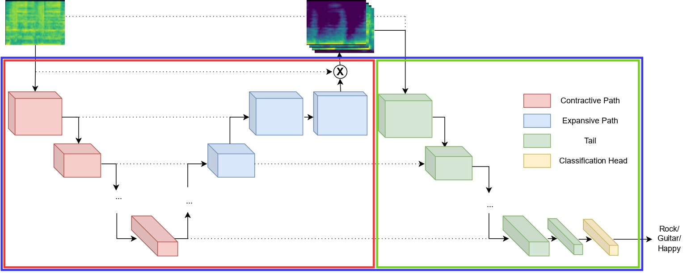

# MSSPT
## Overview
Companion repository for the ICASSP-24 submission "[Pre-Training Music Classification Models via Music Source Separation](https://arxiv.org/pdf/2310.15845.pdf)". In short, we propose pre-training U-Nets with a music source separation objective, and then appending a convolutional frontend upon them, in order to jointly train them in downstream music classification tasks. Experimental results in two widely used music classification datasets, [Magna-Tag-A-Tune](https://mirg.city.ac.uk/codeapps/the-magnatagatune-dataset) and [FMA](https://github.com/mdeff/fma) indicate that the proposed strategy can prove beneficial for music classification tasks. The repository contains the code necessary to reproduce the experiments and results reported in the paper, as well as pre-trained a) music source separation modules and b) downstream classifiers for both downstream tasks, for each possible source(s).
### Important note! 
The results acquired via this repository (and reported in the [submitted paper](https://arxiv.org/pdf/2310.15845.pdf)) in FMA do not correspond to its medium subset, but to the {medium-small} one (excluding thus the small subset).
## Architecture details

The proposed architecture (depicted in the figure above, blue rectangle) is an STFT-domain adaptation of the [TUne+](https://archives.ismir.net/ismir2022/paper/000007.pdf) architecture, modified to fit a traditional supervised learning framework. In essence, it consists of a U-Net network (red rectangle) followed by a convolutional frontend (green rectangle); the U-Net and the convolutional frontend are connected via skip connections. The U-Net is pre-trained with various music source separation objectives, and is based on the baseline architecture described [here](https://arxiv.org/pdf/2109.05418.pdf); the convolutional frontend is a modification of the VGG-like frontend developed by [Won et al.](https://arxiv.org/pdf/2006.00751.pdf), with 2-stem convolutions at each resolution.
## How to work with the repository
### a) Environment setup
The code uploaded in this repository has been developed in ```python 3.9```, using ```tensorflow==2.6.0```; to setup the complete environment in order to reproduce the experiments, you can use the uploaded MSSPT.yml file:

```conda env create -f MSSPT.yml```

### b) U-Net pretraining
For pre-training the U-Nets in music source separation, we made use of the [musdb18](https://sigsep.github.io/datasets/musdb.html#sisec-2018-evaluation-campaign) dataset, which contains full audio excerpts of 150 songs, as well as separate tracks for the vocals, bass, drums, and the rest of the melodic accompaniment for each song. To perform the pre-training process, first isolate segments corresponding to specific-source tracks (for each of the training, validation and testing subsets) by

```python3 preprocess_mss.py path-to-musdb18 subset```

and then pre-train the U-Net with the desired source by

```python3 train_separator.py path-to-musdb18 model-directory source``` (where ```source``` can be one of bass, drums, other, vocal, or multisource)

### c) Downstream classifier training

In order to utilize the pre-trained separator models for downstream classification tasks, use the provided ```train_downstream.py``` script. The training process fully supports preprocessing and loading for the Magna-Tag-A-Tune and FMA datasets (you can write a similar loading + preprocessing pipeline for your own dataset). Since the proposed architecture operates on the STFT magnitude, you can acquire the STFT magnitudes of the downstream datasets by

```python3 preprocess.py dataset path_to_dataset subset``` (```dataset``` can be either 'mtat' or 'fma', ```subset``` one of train, valid, or test)

Then, to jointly finetune the pre-trained separation network along with the classification frontend:

```python3 train_downstream.py dataset path-to-dataset model-directory [-- unet --pretrain separation-model-directory --skips  num_of_skips --multisource] ``` with the optional arguments corresponding to:

```--unet```: whether a U-Net is prepended to the convolutional frontend (included) or not (excluded)

```--pretrain```: if provided, the U-Net is initialized according to the weights of the pre-trained separation models given; if not, the U-Net is initialized randomly.

```---skips```: if provided, ```num_of_skips``` connections are set between the U-Net and the convolutional frontend; it defaults to 5.

```--multisource```: given if the pre-trained U-Net has been pre-trained with a multi-source separation objective.

If you wish to skip the phase of source separation pre-training, you can use one of the pre-trained models provided at the ```models/separators``` directory of the repository as a starting point.

### d) Downstream classifier evaluation

To evaluate an already trained model, simply use the ```evaluate.py``` script as:

```python3 evaluate.py dataset path-to-dataset model-directory [--unet --skips --multisource]```, with the arguments operating similarly to the ```train_downstream.py``` script.

Similar to above, you can evaluate the already uploaded downstream models (which correspond to the best of the 5 runs executed during the conducted experiments) as a starting point; for MTAT, these models (one for each source, as well as the convolutional frontend baseline and the full architecture without source separation pre-training) are located at the ```models/downstream_models/MTAT``` subdirectory; for FMA, at the ```models/downstream_models/FMA``` subdirectory.

## References

[1] Q. Kong et al., “Decoupling Magnitude and Phase Estimation with Deep Res-U-Net for Music Source Separation,” in Proc. ISMIR 2021

[2] M. Won et al., "Evaluation of CNN-Based Automatic Music Tagging Models,” in Proc. SMC 2020

[3] M. Vasquez et al., “Tailed U-Net: Multi-Scale Music Representation Learning,” in Proc. ISMIR 2022

If you find this repository useful to your work, you can also cite the submitted work as:

```
@inproceedings{musicsourceseppretraining,
  title={Pre-Training Music Classification Models via Music Source Separation},
  author={Garoufis, Christos and Zlatintsi, Athanasia and Maragos, Petros},
  booktitle={arXiv preprint arXiv:2310.15845},
  year={2023}
}
```

## Acknowledgements

This research was supported by the Hellenic Foundation for Research and Innovation (H.F.R.I.) under the “3rd Call for H.F.R.I. Research Projects to support Post-Doctoral Researchers” (Project Acronym: i-MRePlay, Project Number: 7773).
