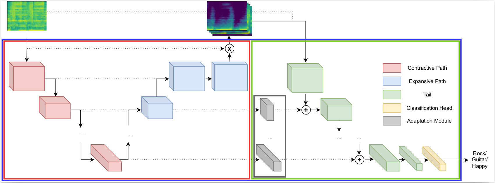

# MSSPT

## Overview
This repository contains the latest version (v2) of the code to reproduce the experiments and results of the paper "[Pre-Training Music Classification Models via Music Source Separation](https://arxiv.org/pdf/2310.15845.pdf)", submitted to EUSIPCO-2024. In short, we propose pre-training U-Nets with a music source separation objective, and then appending a classification frontend, in order to jointly train them in downstream music classification tasks. Experimental results in two widely used music classification datasets, [Magna-Tag-A-Tune](https://mirg.city.ac.uk/codeapps/the-magnatagatune-dataset) and [FMA](https://github.com/mdeff/fma) indicate that the proposed strategy can prove beneficial for music classification tasks.
Additional features, compared to [v1](https://github.com/cgaroufis/MSSPT/tree/v1), include:
- Incorporation of the AST backend, apart from convolutional ones.
- Support for pre-training independently the backend network, or using a pre-trained set of weights for the backend for fine-tuning.
 
Pre-initialized U-Nets and backbone networks (initialized at both ImageNet-derived weights and dataset-specific ones), as well as code for accessing fine-tuned joint models will be made available within the next few days; in the meantime, you can access the models included in v1 from [here](https://github.com/cgaroufis/MSSPT/tree/v1).

## Framework details

The proposed framework (depicted in the figure above for the case of a convolutional backend, blue rectangle) is inspired by the [TUne+](https://archives.ismir.net/ismir2022/paper/000007.pdf) architecture, modified to fit a traditional supervised learning framework and adapted into the STFT domain. In essence, it consists of a U-Net network (red rectangle) followed by a classification frontend (green rectangle); the U-Net and the frontend are connected via a convolutional adaptation module (grey rectangle). 
- The U-Net is pre-trained with various music source separation objectives, and is based on the baseline architecture described [here](https://arxiv.org/pdf/2109.05418.pdf).
- For the classification network we experimented with both convolutional and Transformer-based backends. The convolutional frontend is a modification of the VGG-like frontend developed by [Won et al.](https://arxiv.org/pdf/2006.00751.pdf), with 2-stem convolutions at each resolution; for the Transformer case, we use the [AST](https://arxiv.org/pdf/2104.01778.pdf) backend, which follows a typical Transformer encoder architecture.
- Finally, the adaptation module consists of 1x1 convolutions, to align the feature map dimensions, followed by either spectral downsampling (CNN frontend) or a patchification operation with appropriately sized kernels (AST frontend).

## How to work with the repository
### a) Environment setup
The code uploaded in this repository has been developed in ```python 3.9```, using ```tensorflow==2.6.0``` -- some code for the AST implementation has been adapted from [here](https://github.com/faustomorales/vit-keras). To setup the complete environment in order to reproduce the experiments, you can use the uploaded MSSPT.yml file:

```conda env create -f MSSPT.yml```

### b) U-Net pretraining
For pre-training the U-Nets in music source separation, we made use of the [musdb18](https://sigsep.github.io/datasets/musdb.html#sisec-2018-evaluation-campaign) dataset, which contains full audio excerpts of 150 songs, as well as separate tracks for the vocals, bass, drums, and the rest of the melodic accompaniment for each song. To perform the pre-training process, first isolate segments corresponding to specific-source tracks (for each of the training, validation and testing subsets) by

```python3 preprocess_mss.py path-to-musdb18 subset```

and then pre-train the U-Net with the desired source by

```python3 train_separator.py path-to-musdb18 model-directory source``` (where ```source``` can be one of bass, drums, other, vocal, or multisource)


### c) Downstream classifier training

In order to utilize the pre-trained separator models for downstream classification tasks, use the provided ```train_downstream.py``` script. The training process fully supports preprocessing and loading for the Magna-Tag-A-Tune and FMA datasets, as well as GTZAN (you can write a similar loading + preprocessing pipeline for your own dataset). Since the proposed architecture operates on the STFT magnitude, you can acquire the STFT magnitudes of the downstream datasets by

```python3 preprocess.py dataset path_to_dataset subset``` (```dataset``` can be 'mtat', 'fma', or 'gtzan' ```subset``` one of train, valid, or test)

Then, to jointly finetune the pre-trained separation network along with the classification frontend:

```python3 train_downstream.py dataset path-to-dataset model-directory [-- unet --pretrain separation-model-directory --skips  num_of_skips --multistage [frontend-weights-directory] --multisource] --frontend frontend-type``` with the additional arguments corresponding to:

```--frontend```: denotes whether a CNN ('cnn') or the AST ('transformer') is used as the classification frontend.

```--unet```: whether a U-Net is prepended to the convolutional frontend (included) or not (excluded)

```--pretrain```: if provided, the U-Net is initialized according to the weights of the pre-trained separation models given; if not, the U-Net is initialized randomly.

```--skips```: if provided, ```num_of_skips``` connections are set between the U-Net and the convolutional frontend; it defaults to 5.

```--multistage```: if provided, the feature adaptation module is incorporated. Providing this argument is necessary for using a pretrained frontend -- the directory of the weights is given as an optional argument.

```--multisource```: given if the pre-trained U-Net has been pre-trained with a multi-source separation objective.

If you wish to skip the phase of source separation pre-training, you can use one of the pre-trained models provided at the ```models/separators``` directory of the repository as a starting point.

### d) Downstream classifier evaluation

To evaluate an already trained model, simply use the ```evaluate.py``` script as:

```python3 evaluate.py dataset path-to-dataset model-directory [--unet --skips --multistage --multisource] --frontend frontend-type```, with the arguments operating similarly to the ```train_downstream.py``` script.

## References

[1] Q. Kong et al., “Decoupling Magnitude and Phase Estimation with Deep Res-U-Net for Music Source Separation,” in Proc. ISMIR 2021

[2] M. Won et al., "Evaluation of CNN-Based Automatic Music Tagging Models,” in Proc. SMC 2020

[3] M. Vasquez et al., “Tailed U-Net: Multi-Scale Music Representation Learning,” in Proc. ISMIR 2022

[4] Y. Gong et al., "AST: Audio Spectrogram Transformer", in Proc. Interspeech 2021 


If you find this repository useful to your work, you can also cite the submitted work as:

```
@inproceedings{musicsourceseppretraining,
  title={Pre-Training Music Classification Models via Music Source Separation},
  author={Garoufis, Christos and Zlatintsi, Athanasia and Maragos, Petros},
  booktitle={arXiv preprint arXiv:2310.15845},
  year={2023}
}
```


